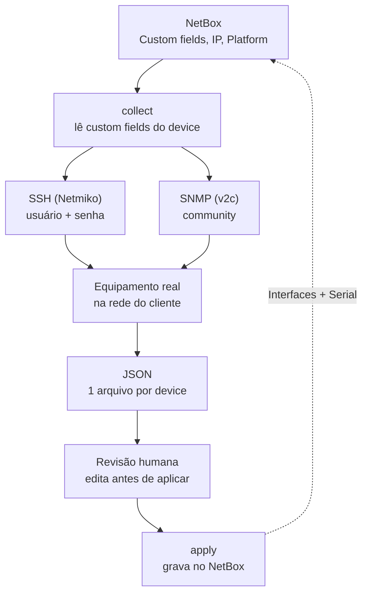

# Projeto NetBox — Docker + Automação de Preenchimento + Descoberta de Rede

Kit de deploy para NetBox via Docker (com suporte a plugins), mais um
conjunto de automações para reduzir cadastro manual — incluindo a
`discovery-ui`, interface web de descoberta de rede via SSH/SNMP.

Este projeto **não reinventa** o docker-compose oficial do NetBox — ele
estende o repositório oficial [`netbox-community/netbox-docker`](https://github.com/netbox-community/netbox-docker)
(branch `release`) via `docker-compose.override.yml`.

**Sobre a versão do NetBox:** a imagem é fixada em `v4.5.10` (não
`latest`) por causa de compatibilidade de plugin — ver a seção
"Versão do NetBox e compatibilidade de plugins" mais abaixo antes de
mudar isso.

Plugins incluídos: **netbox-topology-views** (mapa de topologia) e
**netbox-qrcode** (QR Code pra etiqueta física de device/rack/cabo).

## Estrutura deste repositório

```
netbox-2.0/
├── README.md                      <- este arquivo
├── bootstrap.sh                    <- instalação 1-comando em servidor novo (Docker + tudo)
├── setup.sh                        <- só a parte de clonar netbox-docker + aplicar overlay
├── .gitignore                      <- não deixa segredo/dado de cliente ir pro git
├── .env.example                   <- copie para .env e preencha (por cliente)
├── docker-compose.override.yml    <- overlay sobre o netbox-docker oficial
├── Dockerfile-Plugins              <- build da imagem com plugins
├── plugin_requirements.txt         <- lista de plugins (pip)
├── configuration/
│   └── plugins.py                  <- plugins habilitados no NetBox
├── automation-scripts/             <- scripts pynetbox/netmiko/nmap/snmp
│   ├── requirements.txt
│   ├── import_csv_to_netbox.py     <- importação em massa (CSV/XLSX)
│   ├── discover_network.py         <- descoberta de rede (nmap, fallback)
│   ├── create_discovery_fields.py  <- cria os custom fields de credencial no NetBox
│   ├── discovery_core.py           <- lógica compartilhada (coleta SSH/SNMP + apply), usada pelo CLI e pela discovery-ui
│   └── discovery_netbox.py         <- CLI: lê credencial do NetBox, coleta SSH/SNMP, revisão em JSON, aplica
├── discovery-ui/                   <- interface web de descoberta (login simples -- ver seção 2.4)
│   ├── app.py
│   ├── requirements.txt
│   ├── Dockerfile
│   └── templates/
├── docker-compose.discovery-ui.yml <- instalação STANDALONE (só a discovery-ui, sem subir NetBox -- seção 3)
├── install-discovery-ui.sh         <- instalador 1-comando da instalação standalone
├── .env.discovery-ui.example       <- copie para .env.discovery-ui (instalação standalone)
└── netbox-seed/                    <- catálogo de device types pré-cadastrado (seção 2.5)
    ├── device-catalog.sql          <- dump limpo (sem device/IP/usuário real de cliente)
    └── devicetype-images/          <- fotos de frente/costas referenciadas pelo dump
```

Este é um **repositório template**: nada aqui tem dado de cliente
(senha, IP, planilha). O `netbox-docker` oficial **não fica versionado
aqui** — o `setup.sh` clona ele fresco a cada deploy, então você sempre
usa a última versão estável. Cada cliente tem seu próprio `.env`
(gerado localmente a partir de `.env.example`, nunca commitado — ver
`.gitignore`).

## 1. Subindo o NetBox (Docker, última versão estável, com plugins)

### Servidor novo, sem nada instalado (recomendado para clientes)

Um único comando pros dois cenários — ele pergunta na hora qual dos
dois você quer (Enter = completa):

```bash
curl -fsSL https://raw.githubusercontent.com/andersmonteiro/netbox-2.0/main/bootstrap.sh | bash
```

**1) Completa** — instala Docker + dependências (git, nmap, python3...),
clona este template, sobe o `netbox-docker` oficial com o overlay
aplicado, gera senha/token do superusuário automaticamente, **sobe
também a discovery-ui** (interface web de descoberta, seção 2.4 —
login simples, pensada pro time comercial revisar/aprovar descobertas
sem usar terminal) e deixa a stack no ar. No final ele imprime a URL,
usuário, senha e token gerados (NetBox e discovery-ui) — anote na hora,
não aparecem de novo.

**2) Só a discovery-ui** — pra servidor/cliente que **já tem um NetBox
rodando** (deste template ou não) e você não quer mexer nele: não
clona `netbox-docker`, não builda nem sobe Postgres/NetBox, não
restaura catálogo — só sobe o container da discovery-ui apontando pro
NetBox informado. Docker Engine em si instala normalmente do mesmo
jeito nos dois modos (isso não afeta o que já está em produção). Pede
a URL e o token do NetBox existente na hora; ver seção 3 pra rodar sem
interação (env vars, cron/CI).

Sem terminal interativo (ex: `curl | bash` num script automatizado sem
tty), o default é a instalação completa — pra não quebrar automações
que já usam o one-liner de sempre.

**Senha do superusuário**: se você não tiver exportado
`SUPERUSER_PASSWORD` antes, o script gera uma senha aleatória, mostra
ela na tela e pergunta "Usar essa senha? (Y/n)". Dar Enter (ou "y")
aceita a gerada; "n" pede pra digitar uma senha sua (digitação oculta,
como em `sudo`). Funciona normalmente mesmo rodando via `curl | bash`.
Ela aparece de novo no resumo final da instalação.

**Usando sempre a mesma senha/token (ex: padrão da empresa)**: por
padrão a senha e os tokens são gerados aleatoriamente a cada instalação
— o repositório público nunca tem um valor fixo real. Se você quiser
pular a pergunta e usar sempre a
mesma credencial de produção em todos os clientes, exporte as
variáveis antes do curl (elas ficam só no seu terminal/onde você
guardar o comando, nunca no git):

```bash
export SUPERUSER_PASSWORD='sua-senha-de-verdade'
export SUPERUSER_API_TOKEN='seu-token-fixo-de-40-hex'   # ex: openssl rand -hex 20
export SUPERUSER_API_KEY='sua-key-fixa-de-32-hex'       # ex: openssl rand -hex 16
export DISCOVERY_UI_PASSWORD='sua-senha-fixa-do-oracle' # opcional, ver aviso abaixo
curl -fsSL https://raw.githubusercontent.com/andersmonteiro/netbox-2.0/main/bootstrap.sh | bash
```

Se alguma dessas variáveis não for definida, o bootstrap continua
gerando aleatoriamente só a que faltar. `DISCOVERY_UI_PASSWORD` fixa a
senha de login do NetBox Oracle (a interface de descoberta) e funciona
igual nos dois modos de instalação (completa e só-oracle, seção 3).

> **Senha com caracteres especiais (`!`, por exemplo)**: se a senha
> tiver `!`, digitar o `export` direto no terminal dispara expansão de
> histórico do bash e quebra o comando (mesmo dentro de aspas simples).
> Rode `set +H` antes de colar o bloco acima pra desligar isso na sessão
> atual.

Esse comando só funciona porque o repositório é **público** (sem
segredo nenhum nele — ver seção 7); a VM do cliente não precisa de
nenhuma credencial de GitHub pra isso.

### Servidor que já tem Docker (ou você prefere rodar por partes)

Com o repositório já clonado no servidor:

```bash
./setup.sh --up
```

Isso: clona (ou atualiza) o `netbox-docker` oficial dentro de
`netbox-docker/`, copia os arquivos de customização deste template pra
dentro dele, cria o `.env` a partir do `.env.example` (se ainda não
existir) e sobe a stack com `docker compose build --no-cache && docker
compose up -d`.

**Antes de rodar com `--up` pela primeira vez**, edite
`netbox-docker/.env` com os dados reais do cliente (gere
`SUPERUSER_API_TOKEN` e `SUPERUSER_API_KEY` com `openssl rand -hex 20`
e `openssl rand -hex 16`, por exemplo). Se preferir revisar antes de
subir, rode só `./setup.sh` (sem `--up`), edite o `.env` com calma, e
depois `cd netbox-docker && docker compose up -d`.

**Importante — `CSRF_TRUSTED_ORIGINS`**: também ajuste essa variável no
`.env` pro endereço real que você vai usar pra acessar o NetBox (ex:
`CSRF_TRUSTED_ORIGINS=http://192.168.1.10:8000`). O `bootstrap.sh`
(fluxo acima) faz isso sozinho detectando o IP do servidor; aqui, como
você está editando o `.env` na mão, precisa colocar você mesmo — sem
isso a tela de login trava com "403 — A verificação de CSRF falhou"
mesmo com a senha certa.

> **Não apague a linha `SKIP_SUPERUSER=false` do `.env`.** O
> `netbox-docker` vem com esse valor em `true` por padrão — se essa
> linha sumir do seu `.env`, o container sobe normalmente mas o
> usuário `admin` nunca é criado, e o login falha silenciosamente (a
> senha existe no arquivo, só que não foi usada por ninguém). Se isso
> acontecer: confira que `SKIP_SUPERUSER=false` e `SUPERUSER_API_KEY`
> estão no `.env`, depois `docker compose up -d --force-recreate
> netbox`.

Acesse `http://SEU_SERVIDOR:8000` depois de alguns minutos.

Isso já sobe, além do NetBox: Postgres, Redis, o worker, o housekeeping
e a **discovery-ui** (interface web de descoberta, seção 2.4) — todos
definidos no `docker-compose.override.yml`.

Requisitos: Docker ≥ 20.10.10 e Docker Compose ≥ 1.28 no servidor
(qualquer Linux).

### Versão do NetBox e compatibilidade de plugins

A imagem base é `netboxcommunity/netbox:v4.5.10` (ver `Dockerfile-Plugins`),
**não** `latest`. Isso foi decisão consciente, não esquecimento:

- `netbox-topology-views` (mapa de topologia) hoje só declara suporte
  até NetBox 4.5.X. Não existe release compatível com a linha 4.6
  ainda — se a imagem usasse `latest` (hoje = v4.6.3), o build passa
  mas o plugin quebra/some da interface em runtime.
- `v4.5.10` (05/05/2026) foi o **último patch da série 4.5**. A série
  4.6 saiu no dia seguinte e já recebeu 3 patches próprios desde então
  (4.6.1, 4.6.2, 4.6.3) sem nenhum backport pra 4.5.x — é o padrão
  normal do NetBox: quando sai uma minor nova, o bugfix migra pra ela
  e a anterior para de receber patch. Na prática, a série 4.5 está
  congelada: não existe mais "ficar em 4.5.x e receber atualização
  automática" — por isso fixamos o número exato (`v4.5.10`) em vez da
  tag flutuante `v4.5`, pra deixar isso explícito.

**Risco que isso implica:** se aparecer uma falha de segurança na
série 4.5, não deve vir patch pra ela. Se isso acontecer, as opções
são: (a) confirmar se o `netbox-topology-views` já suporta 4.6 e fazer
o bump completo (tabela abaixo), (b) remover o `netbox-topology-views`
temporariamente e subir pra 4.6, ou (c) aceitar o risco por um tempo
controlado. Vale checar esporadicamente se saiu uma versão nova do
plugin, mesmo sem estar planejando upgrade.

Tabela de compatibilidade dos plugins deste template, hoje (NetBox 4.5.x):

| Plugin | Versão pinada | Compatível com 4.5.x | Compatível com 4.6.x |
| --- | --- | --- | --- |
| netbox-topology-views | 4.5.1 | Sim | Não (sem release ainda) |
| netbox-qrcode | 0.0.20 | Sim | Não (precisa 0.0.21) |

**Como fazer upgrade pra NetBox 4.6+ no futuro:** confira se
`netbox-topology-views` já lançou versão pra 4.6 (é normalmente o
gargalo — o `netbox-qrcode` já tem release pronta pra 4.6). Se sim,
atualize os pins em `plugin_requirements.txt` junto com o
`FROM netboxcommunity/netbox:v4.6.X` (use o número exato do patch mais
recente da série 4.6 nessa hora, pelo mesmo motivo acima) no
`Dockerfile-Plugins` **na mesma mudança**, e rode
`docker compose build --no-cache` num ambiente de teste antes de
aplicar em cliente. Nunca mude só a versão do NetBox sem checar essa
tabela primeiro.

## 2. Automações de preenchimento

Você pediu três frentes — seguem as três, cada uma resolvendo um cenário
diferente. Elas não se excluem: normalmente se usa CSV para a carga
inicial, a descoberta via SSH/SNMP (seção 2.4) para manter os devices já
cadastrados atualizados, e scan/descoberta para achar o que ainda não
está no NetBox.

### 2.1 Importação em massa via CSV/Excel

`automation-scripts/import_csv_to_netbox.py` lê uma planilha e faz
upsert (cria ou atualiza) de Sites, Devices ou IPs.

```bash
cd automation-scripts
python3 -m venv .venv && source .venv/bin/activate
pip install -r requirements.txt
export NETBOX_URL=http://localhost:8000
export NETBOX_TOKEN=<seu token>

python import_csv_to_netbox.py sites   planilhas/sites.xlsx
python import_csv_to_netbox.py devices planilhas/devices.csv
python import_csv_to_netbox.py ips     planilhas/ip_addresses.csv
```

Colunas esperadas: veja o docstring no topo de cada função no script.
Ele foi feito para ser fácil de adaptar caso sua planilha use nomes de
coluna diferentes.

### 2.2 Coleta automática via SSH/SNMP

Pra devices que **já existem** no NetBox (cadastrados via CSV no passo
2.1, por exemplo) e você quer completar automaticamente com número de
série, versão de SO e interfaces reais do equipamento, use
`automation-scripts/discovery_netbox.py` -- é o mesmo CLI de descoberta
detalhado na seção 2.4, só que puxando os devices direto pelas
credenciais já cadastradas no NetBox (Custom Fields) em vez de você
digitar usuário/senha na hora:

```bash
cd automation-scripts
python discovery_netbox.py collect --site "Matriz"
python discovery_netbox.py apply
```

Pré-requisito: o Device no NetBox precisa ter os custom fields de
descoberta preenchidos (`discovery_method` + credencial correspondente
-- ver `create_discovery_fields.py`) e `primary_ip4` definido. A coleta
via SSH é feita com Netmiko puro (sem NAPALM) -- o jeito de conectar é
resolvido automaticamente pelo Fabricante do device (Cisco/Juniper/
Arista/Palo Alto/Huawei); veja a seção 2.4 pra detalhes completos do
fluxo (revisão humana antes de gravar, etc.).

### 2.3 Descoberta de rede

**`discover_network.py` (incluso neste pacote):** faz um ping sweep com
`nmap` e cria IPs no NetBox com a tag `auto-discovered` para revisão
manual.

```bash
python discover_network.py 10.0.0.0/24 --site "Matriz"
```

Pra descoberta com detalhe (interfaces, serial, versão de SO via
SSH/SNMP), use a `discovery-ui`/`discovery_netbox.py` da seção 2.4.

### 2.4 Enriquecimento a partir de credenciais cadastradas no NetBox

Caminho recomendado de descoberta: (a) cadastra a credencial de cada
device direto no NetBox (sem editar YAML/reiniciar container), e (b)
**revisa o resultado antes de gravar** — nada é aplicado automático,
sempre passa por um passo explícito de confirmação.



O NetBox nunca é alterado direto pelo `collect` — sempre passa por um
arquivo JSON no meio, com chance de revisão humana antes do `apply`.

Duas formas de usar esse fluxo: pela **interface web** (`discovery-ui`
— recomendado pra quem não usa terminal, ex: time comercial) ou pela
**linha de comando** (`discovery_netbox.py` — pra automação/scripts).
Os dois compartilham a mesma pasta `discovery_output/` como fila de
pendências, então um device coletado por um aparece pra revisão no
outro.

#### Interface web (discovery-ui)

Já sobe junto com o `bootstrap.sh`, em `http://SEU_SERVIDOR:5050`
(login/senha nas credenciais impressas no final da instalação — ver
`.env` do NetBox, variáveis `DISCOVERY_UI_USER`/`DISCOVERY_UI_PASSWORD`
se precisar consultar depois).

1. **Login** — usuário/senha simples, não integrado ao NetBox (é só
   pra controlar quem acessa a tela, não um sistema de permissões).
2. **Devices** (tela inicial) — lista todos os devices já cadastrados
   no NetBox, com Site, IP de gerência, Platform, método de descoberta
   e um status "pronto"/"incompleto". Marque os que quiser descobrir e
   clique em "Rodar descoberta nos selecionados".
3. **+ Cadastrar device** — pra um device que ainda não existe no
   NetBox: nome, Site, Device Role, Device Type (esses três últimos
   precisam já existir no NetBox — são cadastro único por instalação,
   não por device), IP de gerência, Platform (só se for usar SSH) e as
   credenciais de descoberta (usuário/senha SSH, ou community SNMP).
   O botão "editar" na lista de devices abre o mesmo formulário pra
   quem já existe, pra completar/trocar IP, Platform ou credencial.
4. **Revisão** — depois de rodar a descoberta, cada device aparece
   como um card com a lista de interfaces encontradas: checkbox pra
   incluir/excluir cada uma e campo de descrição editável antes de
   gravar. Nada vai pro NetBox até você clicar em "Aprovar e gravar no
   NetBox" — ou "Descartar" se não quiser aplicar nada daquela coleta.

#### Linha de comando (CLI) — para automação/scripts

Mesma lógica de baixo nível por trás da discovery-ui (`discovery_core.py`),
útil se você quiser rodar via cron, testar contra um device específico
sem passar pela tela, ou integrar num pipeline próprio.

Passo 1 — criar os Custom Fields de descoberta (uma vez só, por
instalação):

```bash
cd automation-scripts
python create_discovery_fields.py
```

Isso cria em Devices: `discovery_method` (ssh/snmp), `discovery_username`,
`discovery_password`, `discovery_snmp_community`. Aparecem normalmente
no formulário de "Adicionar/Editar Device" do NetBox — cadastrar um
device pra descoberta vira só preencher esses campos ali, sem tocar em
arquivo nenhum.

> **Aviso de segurança**: são Custom Fields comuns do NetBox community
> (sem plugin de secrets) — ficam em texto simples, visíveis pra
> qualquer usuário com permissão de ver aquele Device, inclusive via
> API. Se isso for um problema no seu ambiente, avalie o plugin
> `netbox-secrets` (criptografado) em vez destes campos.

Passo 2 — preencher os campos nos devices que quiser descobrir
(`discovery_method=ssh` + `discovery_username`/`discovery_password`,
ou `discovery_method=snmp` + `discovery_snmp_community`), e rodar a
coleta:

```bash
python discovery_netbox.py collect
```

Isso conecta em cada device marcado (SSH via Netmiko puro, device_type
resolvido pelo Fabricante; SNMPv2c via `snmpget`/`snmpwalk` — instale o
pacote `snmp` do sistema se não usou o `bootstrap.sh`) e grava um JSON
por device em `discovery_output/` com hostname, interfaces e status
up/down de cada uma. **Nada é gravado no NetBox ainda.**

Passo 3 — revisar. Os JSON ficam em `discovery_output/`, um por
device — abra e edite à vontade (corrigir nome de interface, remover
alguma, etc.) antes do próximo passo. O resumo já impresso no terminal
também serve pra conferir rápido sem abrir arquivo.

Passo 4 — aplicar no NetBox:

```bash
python discovery_netbox.py apply
```

Pede confirmação (`y/N`) antes de gravar — use `apply --yes` se quiser
pular a pergunta (ex: rodando via cron depois que já confiar no
processo). Cria as interfaces que faltam, atualiza status/descrição das
que já existem e o serial do device (quando veio via SSH — SNMP
não traz serial pela MIB-II padrão). Os arquivos aplicados são movidos
pra `discovery_output/applied/` (não ficam pendentes de novo se você
rodar `apply` de novo sem um `collect` novo antes).

### 2.5 Catálogo de device types pré-cadastrado

O `bootstrap.sh` já sobe o NetBox com um catálogo de ~100 device types
(manufacturers, templates de interface, porta de força, etc.)
pré-cadastrado, com as fotos de frente/costas de cada um — poupa o
trabalho manual de cadastrar Device Type na mão pra equipamentos comuns
(MikroTik, Huawei, Datacom, Furukawa, Dell, etc.).

Isso vem de dois arquivos:

- `netbox-seed/device-catalog.sql` — dump do Postgres só com o catálogo
  (manufacturers, device types, templates). **Não tem nenhum device,
  IP ou usuário real** — essas tabelas são removidas do dump antes de
  ir pro repositório (junto com sessão e log de auditoria), justamente
  por este repositório ser público.
- `netbox-seed/devicetype-images/` — as fotos referenciadas pelo dump
  acima, mapeadas via `docker-compose.override.yml` direto pra dentro
  do volume de mídia do NetBox (`/opt/netbox/netbox/media/devicetype-images`).

**Isso só é restaurado na 1ª instalação**, quando o banco Postgres
ainda está vazio (o `bootstrap.sh` sobe só o Postgres primeiro, checa
se a tabela `django_migrations` existe, e só restaura se não existir).
Numa reinstalação sobre um banco que já tem dado — seu ou de outro
cliente — isso é pulado automaticamente, não sobrescreve nada.

Se quiser testar/reaplicar manualmente (ex: banco vazio fora do fluxo
do `bootstrap.sh`):

```bash
cd netbox-docker
docker compose up -d postgres
docker compose exec -T postgres psql -U netbox -d netbox < ../netbox-seed/device-catalog.sql
```

Nem toda foto do catálogo tem uma imagem correspondente em
`devicetype-images/` ainda — os device types sem foto aparecem sem
imagem no NetBox até alguém subir o arquivo certo (Device Types > editar
> Front/Rear image).

## 3. Instalação standalone do NetBox Oracle (cliente que já tem NetBox)

Pra clientes que **já têm um NetBox rodando** (deste template ou de
qualquer outra instalação) e só querem a ferramenta de descoberta
apontando pra ele via API — sem subir NetBox, Postgres, Redis nem nada
do resto da stack, e **sem mexer no que já está em produção**. Sobe só
o container `netbox-oracle`.

**Comando padrão (recomendado)** — é o mesmo `bootstrap.sh` da seção 1,
um único instalador pros dois cenários. Rodando com terminal
interativo (qualquer SSH normal), ele pergunta "1) Completa / 2) Só o
NetBox Oracle" na hora — escolha 2, e em seguida ele pede a URL e o
token do NetBox do cliente:

```bash
curl -fsSL https://raw.githubusercontent.com/andersmonteiro/netbox-2.0/main/bootstrap.sh | bash
```

**Pulando a pergunta** (obrigatório em cron/CI sem terminal, ou só pra
não precisar escolher): exporte `NETBOX_URL`/`NETBOX_TOKEN` antes — ele
detecta o modo sozinho e nem chega a perguntar:

```bash
export NETBOX_URL='http://IP_OU_HOST_DO_NETBOX_DO_CLIENTE:8000'
export NETBOX_TOKEN='token-de-api-com-permissao-de-escrita-em-dcim-ipam'
curl -fsSL https://raw.githubusercontent.com/andersmonteiro/netbox-2.0/main/bootstrap.sh | bash
```

`install-discovery-ui.sh` é só um atalho de 3 linhas que chama o
`bootstrap.sh` acima já fixo no modo discovery-only (equivale a
exportar `INSTALL_MODE=discovery-only`) — mesmo resultado, mas pula a
pergunta "1 ou 2" de propósito. Prefira o `bootstrap.sh` puro como
padrão; use o atalho só se realmente quiser garantir esse modo sem
depender da detecção automática.

**Senha fixa da tela do NetBox Oracle**: por padrão a senha de login é
gerada aleatória a cada instalação. Pra usar sempre a mesma (ex: padrão
da empresa), exporte `DISCOVERY_UI_PASSWORD` junto com as duas de cima
— mesmo aviso do `set +H` da seção 1 se ela tiver `!`:

```bash
export NETBOX_URL='http://IP_OU_HOST_DO_NETBOX_DO_CLIENTE:8000'
export NETBOX_TOKEN='token-de-api-com-permissao-de-escrita-em-dcim-ipam'
export DISCOVERY_UI_PASSWORD='sua-senha-fixa'
curl -fsSL https://raw.githubusercontent.com/andersmonteiro/netbox-2.0/main/bootstrap.sh | bash
```

O resto (usuário da tela, chave de sessão) é gerado automaticamente —
aparece no resumo final. Detalhes de uso da interface (dashboard,
cadastro de device, revisão/aprovação) estão na seção 2.4, é a mesma
tela.

**Cliente com IPAM já preenchido**: se o NetBox do cliente já tem IPs
cadastrados de antes (comum — endereço de gerência já documentado com
outro prefixo, ex: um `/30` de um link, ou já associado a outro device/
interface, ou já marcado como Primary IP de outro device), o Oracle
detecta o conflito automaticamente e REASSOCIA o registro existente pra
cá em vez de bloquear — o que foi digitado na tela do Oracle é tratado
como fonte de verdade de onde aquele IP está fisicamente hoje. Isso
desassocia o IP de onde estava antes, então confira o valor digitado
antes de salvar.

## 4. Ordem sugerida de implementação

1. Suba o NetBox (seção 1) e crie o superusuário.
2. Cadastre a estrutura básica manualmente ou via CSV: Sites, Manufacturers,
   Device Types, Device Roles (seção 2.1).
3. Rode a coleta via SSH/SNMP para enriquecer os devices já cadastrados
   (seção 2.2).
4. Cadastre as credenciais de descoberta pela discovery-ui e rode as
   primeiras descobertas (seção 2.4).

## 5. Uso com GitHub (template público + múltiplos clientes)

Este repositório é **público** de propósito: é só ferramenta/automação
genérica, sem dado de cliente (o `.gitignore` bloqueia `.env`,
planilhas etc. — ver seção 6). Isso permite que qualquer servidor de
cliente rode o `bootstrap.sh` via `curl | bash` (seção 1) sem precisar
de chave SSH nem token de acesso.

**Criar/configurar o repositório no GitHub:**

Na tela de criação, deixe **Visibility = Public**, desligue o toggle
"Add README" (a pasta local já tem um), e não adicione `.gitignore`
nem license por lá. Depois, localmente:

```bash
cd D:\projetos-natverk\netbox-2.0
git init -b main
git add -A
git commit -m "Template inicial: NetBox + Docker + automações + descoberta de rede"
git remote add origin https://github.com/andersmonteiro/netbox-2.0.git
git push -u origin main
```

Se você já criou o repositório como Private em alguma tentativa
anterior, dá pra mudar depois: Settings do repo → rolar até "Danger
Zone" → **Change visibility** → Public.

**Fluxo por cliente:**

1. No servidor do cliente (novo, sem nada instalado):
   `curl -fsSL https://raw.githubusercontent.com/andersmonteiro/netbox-2.0/main/bootstrap.sh | bash`
   — isso já clona o template, instala Docker, sobe tudo.
2. Edite `netbox-2.0/netbox-docker/.env` (gerado automaticamente pelo
   bootstrap com senha/token aleatórios) se precisar ajustar algo
   específico desse cliente. Esse arquivo nunca é commitado, fica só no
   servidor do cliente.
3. Se esse cliente precisar de alguma customização que não deveria ir
   pro template (ex: um plugin específico), ou você faz isso só
   localmente ali no servidor (sem commitar), ou mantém um fork do
   template pra esse cliente. Não recomendo commitar particularidades
   de cliente direto no `main` do template público.
4. Melhorias genéricas (novo script, ajuste no compose, plugin novo de
   uso geral) entram no `main` do template via commit/push normal, e os
   outros clientes recebem rodando `bootstrap.sh`/`setup.sh` de novo
   (faz `git pull` internamente).

## 6. Segurança — o que NUNCA deve ir para este repositório (é público!)

- `.env` / `.env.discovery-ui` (senhas, tokens de API do NetBox)
- Planilhas de importação com IPs/hostnames reais de cliente
- Nomes de clientes, topologia de rede real, ou qualquer coisa que
  identifique um cliente específico — isso é template, não deploy

O `.gitignore` já cobre os itens óbvios, mas como o repo é público,
**revise sempre** antes de cada `git push` — `git status` e
`git diff --cached` são seus amigos. Se algo sensível for commitado por
engano, trocar de visibilidade não apaga o histórico: é preciso
reescrever o histórico (`git filter-repo` ou similar) ou, no limite,
recriar o repositório.

## Fontes usadas na pesquisa deste projeto

- [netbox-community/net